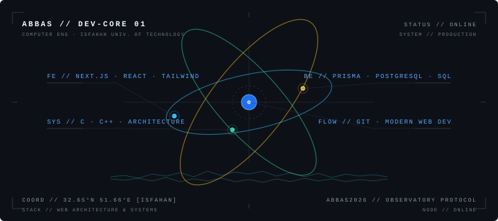

  

### Overview

- **Education:** Computer Engineering @ Isfahan University of Technology (IUT)
- **Focus:** Modern Web Development, Frontend Architecture & Reactive Interfaces
- **Current Stack:** React, Next.js, Tailwind CSS, Prisma, PostgreSQL & SQL Server

---

### Technologies

#### Frontend

  
  
  
  
  
  

#### Backend & Databases

  
  
  

#### Systems & Tools

  
  
  
  

---

### Contribution Activity

  
  

---

### 3D Contribution Graph

  

